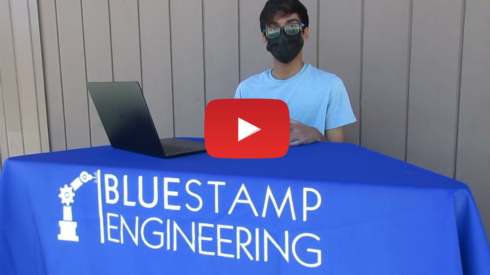

# Raspberry Pi Image Recognition
This will serve as a brief description of your project. Limit this to three sentences because it can become overly long at that point. This copy should draw the user in and make she/him want to read more.

| **Engineer** | **School** | **Area of Interest** | **Grade** |
|:--:|:--:|:--:|:--:|
| Sid T. | DVHS | Electrical Engineering | Incoming Junior

  
# Final Milestone
My final milestone is the increased reliability and accuracy of my robot. I ameliorated the sagging and fixed the reliability of the finger. As discussed in my second milestone, the arm sags because of weight. I put in a block of wood at the base to hold up the upper arm; this has reverberating positive effects throughout the arm. I also realized that the forearm was getting disconnected from the elbow servo’s horn because of the weight stress on the joint. Now, I make sure to constantly tighten the screws at that joint. 

{:target="_blank" rel="noopener"}

# Second Milestone
My final milestone is the increased reliability and accuracy of my robot. I ameliorated the sagging and fixed the reliability of the finger. As discussed in my second milestone, the arm sags because of weight. I put in a block of wood at the base to hold up the upper arm; this has reverberating positive effects throughout the arm. I also realized that the forearm was getting disconnected from the elbow servo’s horn because of the weight stress on the joint. Now, I make sure to constantly tighten the screws at that joint.

{:target="_blank" rel="noopener"}

# First Milestone
My first milestone was setting up and hooking up the Raspberry Pi and all the necessary components onto my tv. The heatsinks, the sd card, and the controller were all added to ensure that the Raspberry Pi was working. Instead of the Raspberry Pi Os software, I had to first download a different software called Retro Pie. With Retro Pie, I needed to download an Imager for Raspberry Pi. Raspberry Pi Imager automatically downloads a list of the latest versions of Raspbian supported by the Raspberry Pi. Raspbian is the typical Raspberry Pi Os software, the one I needed on the Raspberry Pi was Retro Pi. With the included SD card, I plugged in the SD into my computer and launched the Imager. The imager allowed me to set the Operating System to Retro Pi instead of Raspbian onto the SD card. With the OS imaged onto the SD, I plugged the SD card back into the Raspberry Pi and rebooted the system and Retro Bi booted up.

{:target="_blank" rel="noopener"}

# Starter Project
My starter project was the binary blaster, which is a game in which the player converts hexadecimal numbers to binary numbers. The device is battery powered and has two eight-segment displays along with four switches. This is my first milestone. I’ve finished assembling the device, and it is fully functional.After powering the device on, the game starts. The hexadecimal number is shown on the display, and I can put in the binary version using the buttons. During this project, I enjoyed being able to brush up on my soldering skills, as it’s something that I haven’t done in a while. One thing that I struggled on was the direction of the buttons. If they were put in the wrong way, their embedded LEDs would not light up. I had originally soldered three of the buttons the wrong way, so I had to cut the traces on the PCB and manually bridge a few pads to fix the issue.In the future, it might be interesting to edit the preinstalled code on the microcontroller to change the way that the game works.

<iframe width="560" height="315" src="https://www.youtube.com/embed/dQw4w9WgXcQ" frameborder="0" allow="autoplay; encrypted-media" allowfullscreen></iframe>

{:target="_blank" rel="noopener"}
